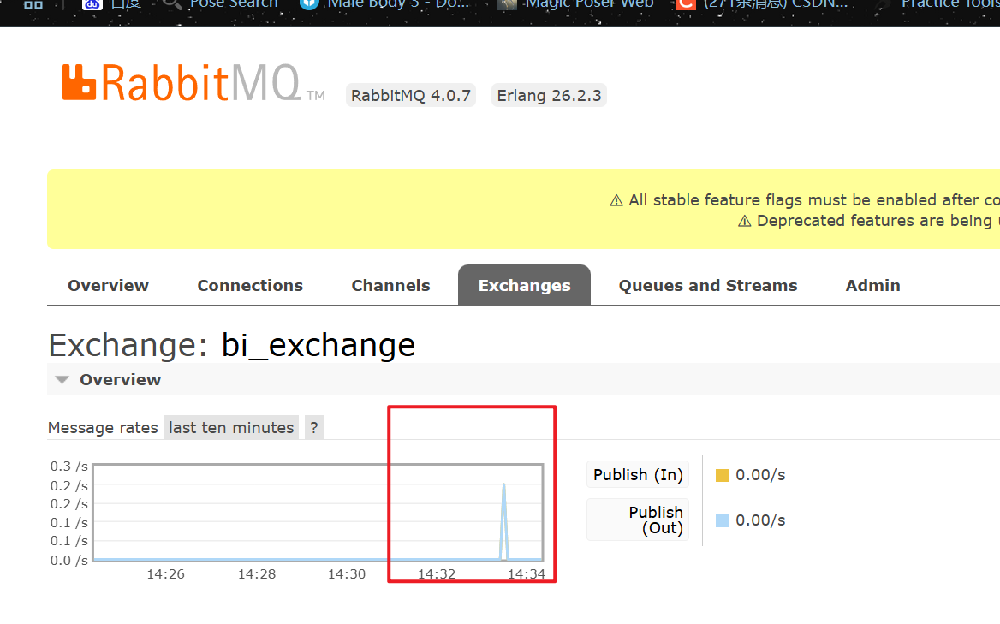

# 智能BI项目


## 项目介绍

BI 商业智能：数据可视化、报表可视化系统

主流 BI 平台：帆软 BI、小马 BI、微软 Power BI


### 传统 BI 平台：

https://chartcube.alipay.com/

特点：

1. 需要人工上传数据
2. 需要人工托选分析要用到的数据行和列（数据分析师）
3. 需要人工选择图表类型（数据分析师）
4. 生成图表（保存配置）


### 智能 BI 平台

区别于传统的 BI，用户（（数据分析者）只需要导入最最最原始的数据

，输入想要进行分析的目标（比如帮我分析一下网站的增长趋势），就能利用 AI 自动生成一个符合要求的图表以及结论。


优点：让不会数据分析的同学也能通过输入目标快速完成数据分析，大幅节约人力成本。会使用到 AI


### 需求分析

1. 智能分析：用户输入目标和原始数据（图表类型），可以自动生成图表和分析结论
2. 图表管理
3. 图表生成的异步化（消息队列）
4. 对接 AI 能力


### 架构图


### 技术栈

#### 后端

1. Spring Boot（万用 Java 后端项目模板，快速搭建基础框架，避免重复写代码）
2. MySQL 数据库
3. MyBatis Plus 数据访问框架
4. 消息队列（RabbitMQ）
5. AI 能力（Open AI 接口开发 / 提供现成的 AI 接口）
6. Excel 的上传和数据的解析（Easy Excel）
7. Swagger + Knife4j 接口文档


## 后端项目初始化

### 库表设计

用户表：

```mysql
-- 用户表
create table if not exists user
(
    id           bigint auto_increment comment 'id' primary key,
    userAccount  varchar(256)                           not null comment '账号',
    userPassword varchar(512)                           not null comment '密码',
    userName     varchar(256)                           null comment '用户昵称',
    userAvatar   varchar(1024)                          null comment '用户头像',
    userProfile  varchar(512)                           null comment '用户简介',
    userRole     varchar(256) default 'user'            not null comment '用户角色：user/admin/ban',
    createTime   datetime     default CURRENT_TIMESTAMP not null comment '创建时间',
    updateTime   datetime     default CURRENT_TIMESTAMP not null on update CURRENT_TIMESTAMP comment '更新时间',
    isDelete     tinyint      default 0                 not null comment '是否删除',
    index idx_userAccount (userAccount)
) comment '用户' collate = utf8mb4_unicode_ci;
```


图表信息表：

```mysql
-- 图表信息表
create table if not exists chart
(
    id         bigint auto_increment comment 'id' primary key,
    goal       text                               null comment '分析目标',
    chartData  text                               null comment '图表数据',
    chartType  varchar(128)                       null comment '图表类型',
    userId         bigint null comment '创建用户Id',
    genChart   text                               null comment '生成的图表数据',
    genResult  text                               null comment '生成的分析结论',
    createTime datetime default CURRENT_TIMESTAMP not null comment '创建时间',
    updateTime datetime default CURRENT_TIMESTAMP not null on update CURRENT_TIMESTAMP comment '更新时间',
    isDelete   tinyint  default 0                 not null comment '是否删除'
) comment '图表信息表' collate = utf8mb4_unicode_ci;
```


### 自动生成代码

1. 建表
2. 使用 `MybatisX`插件生成代码
3. 迁移生成的代码
4. 复制老的增删改查模板，根据的表重构
5. 根据接口文档来测试


## 智能分析业务开发

### 业务流程

1. 用户输入
   1. 分析目标
   2. 上传原始数据（Excel）
   3. 更精细地控制图表，比如图表类型、图表名称等
2. 后端校验
   1. 校验用户的输入是否合法（比如长度）
   2. 成本控制（次数统计和校验、鉴权等）
3. 把处理的数据输入给 AI 模型（调用 AI 接口），让 AI 模型给我们提供图表信息、结论文本
4. 图表信息、结论文本在前端进行展示


### 开发接口

根据用户输入（文本和文件），最后返回图表信息和结论文本

给 chart 表补充 name 字段


#### 原始数据压缩

AI 接口普遍都有输入字数限制，尽可能压缩数据，能够允许多传一些数据

如何向 AI 提词（prompt）？

AI 提词技巧：持续输入、持续优化；

​						数据压缩

​						在系统（模型）层面做预设效果一般来说，会比直接拼接在用户消息里效果更好一些

使用 csv 对 excel 文件的数据进行提取和压缩

开源库：https://easyexcel.opensource.alibaba.com/docs/current/

逐步来，先读取出数据：


压缩后：


### 调用 AI：

输入：

系统预设（提前告诉它职责、功能、回复格式要求） + 分析目标 + 压缩后的数据

最简单的系统预设：你是一个数据分析师，接下来我会给你我的分析目标和原始数据，请告诉我分析结论

## 智能分析业务流程开发

### 利用 AI 生成结论和图表

#### 生成结论

就是平时用文字问 AI 那种，比如：

你是一个数据分析师，接下来我会给你我的分析目标和原始数据

原始数据：


#### 生成图表

AI 无法直接生成现成的图表，但是 AI 生成图表代码 => 可以把代码利用前端的组件库（Echart）在网页展示


预期生成的图表代码：

```javascript
option = {
  xAxis: {
    type: 'category',
    data: ['Mon', 'Tue', 'Wed', 'Thu', 'Fri', 'Sat', 'Sun']
  },
  yAxis: {
    type: 'value'
  },
  series: [
    {
      data: [150, 230, 224, 218, 135, 147, 260],
      type: 'line'
    }
  ]
};
```


#### AI 提问技巧

如果想要让 AI 更好地理解我们的输入，给我们预期的、精确格式的输出、我们就需要严格控制我们的提问词

1. 使用系统预设

   分析需求：
   分析网站用户的增长情况
   原始数据：
   日期,用户数
   1号,10
   2号,20
   3号,30

2. 控制输入格式

   你是一个数据分析师和前端开发专家，接下来我会按照以下固定格式给你提供内容：
   分析需求：
   {数据分析的需求或者目标}
   原始数据：
   {csv格式的原始数据，用,作为分隔符}
   请根据这两部分内容，按照以下指定格式生成内容（此外不要输出任何多余的开头、结尾、注释）
   【【【【
   {前端 Echarts V5 的 option 配置对象js代码，合理地将数据进行可视化，不要生成任何多余的内容，比如注释}
   【【【【
   {明确的数据分析结论、越详细越好，不要生成多余的注释}

   

   生成的内容：

   ```js
   【【【【
   {
       title: {
           text: '网站用户增长情况',
           subtext: ''
       },
       tooltip: {
           trigger: 'axis',
           axisPointer: {
               type:'shadow'
           }
       },
       legend: {
           data: ['用户数']
       },
       xAxis: {
           data: ['1号', '2号', '3号']
       },
       yAxis: {},
       series: [{
           name: '用户数',
           type: 'bar',
           data: [10, 20, 30]
       }]
   }
   【【【【
   根据数据分析可得，该网站用户数量逐日增长，时间越长，用户数量增长越多。
   ```

   


### 3 种调用 AI 的方式

#### 1、直接调用 OpenAI 或者其他 AI 原始大模型官网的接口

官方文档：https://platform.openai.com/docs/api-reference
优点：不经封装，最灵活，最原始
缺点：要钱 

本质上 OpenAI 就是提供了 HTTP 接口，我们可以用任何语言去调用

1) 在请求头中指定 OPENAI_API_KEY
Authorization: Bearer OPENAI_API_KEY
2) 找到你要使用的接口，比如 AI 对话接口：https://platform.openai.com/docs/api-reference/chat/create
3) 按照接口文档的示例，构造 HTTP 请求，比如用 Hutool 工具类、或者 HTTPClient


### 2、使用云服务商提供的，封装后的 AI 接口

优点：本地能用

缺点：要钱，可能比直接调用原始接口要贵

使用讯飞星火，参考leikooo佬的教程：

https://www.codefather.cn/post/1806571470552477698#heading-0

GitHub 地址：

https://github.com/briqt/xunfei-spark4j?tab=readme-ov-file#%E4%BD%BF%E7%94%A8%E6%96%B9%E5%BC%8F


使用 ECharts 在线调试：

https://echarts.apache.org/examples/en/editor.html?c=line-simple

 

运行结果：

```js
option = {
  title: { text: '详细分析网站用户增长趋势' },
  xAxis: { type: 'category', data: ['1号', '2号', '3号'] },
  yAxis: { type: 'value' },
  series: [{ name: '用户数', type: 'line', data: [10, 20, 30] }]
};

```


图示：


### 智能接口实现

1. 构造用户请求（用户信息、csv 数据、图表类型）
2. 调用 讯飞星火 sdk，得到 AI 响应结果
3. 从 AI 响应结果中，取出需要的信息
4. 保存图表到数据库


## 安全性

### 只要涉及到用户自主上传的操作，一定要校验文件（图像）

校验的维度：

- 文件的大小

- 文件的后缀

- 文件的内容（成本要高一些）

- 文件的合规性（比如敏感内容，建议用第三方的审核功能）

- > 扩展点：接入腾讯云的图片万象数据审核（COS 对象存储的审核功能）

```java
// 校验
        ThrowUtils.throwIf(StringUtils.isBlank(goal), ErrorCode.PARAMS_ERROR, "目标为空");
        ThrowUtils.throwIf(StringUtils.isNotBlank(name) && name.length() > 100, ErrorCode.PARAMS_ERROR, "名称过长");
        // 校验文件
        String originalFilename = multipartFile.getOriginalFilename();
        long size = multipartFile.getSize();
        // 校验文件大小
        final long ONE_MB = 1024 * 1024;
        ThrowUtils.throwIf(size > ONE_MB, ErrorCode.PARAMS_ERROR, "文件超过 1MB");
        // 校验文件后缀 aa.png
        String suffix = FileUtil.getSuffix(originalFilename);
        final List<String> validFileSuffixList = Arrays.asList("png", "jpg", "svg", "webp", "jpeg");
        ThrowUtils.throwIf(!validFileSuffixList.contains(suffix), ErrorCode.PARAMS_ERROR, "文件超过 1MB");

```


### 数据存储

现状：我们把每个图表的原始数据全部存放在了同一个数据表（chart 表）的字段里。
问题：

1. 如果用户上传的原始数据量很大、图表数日益增多，查询 Chart 表就会很慢。
2. 对于 BI 平台，用户是有查看原始数据、对原始数据进行简单查询的需求的。现在如果把所有数据存放在一个字段（列）中，查询时，只能取出这个列的所有内容。 

解决方案：分库分表

把每个图表对应的原始数据单独保存为一个新的数据表，而不是都存在一个字段里


这样：

1. 存储时，能够分开存储，互不影响（也能增加安全性）
2. 查询时，可以使用各种 sql 语句灵活取出需要的字段，查询性能更快


### 实现

分开存储：

1. 存储图表信息时，不把数据存储为字段，而是新建一个 chart_{图表id} 的数据表

   通过图表id、数据列名、数据类型等字段，生成一下 SQL 语句，并且执行即可，在 go to DDL 复制

   ```sql
   -- auto-generated definition
   create table chart_1906317644332654594
   (
       日期   int null,
       用户数 int null
   );
   ```


分开查询：

1、以前直接查询图表，取 chartData 字段；现在改为读取chart_{图表id} 的数据表

```sql
select * from chart_1906317644332654594
```


具体实现：MyBatis 的动态 SQL（根据代码灵活地动态生成）

1. 想清楚哪些是需要动态替换的，比如要查询的数据表名 chart_{}
2. 在 mapper.xml 中定义 sql 语句

以下这种方式，但是要小心 SQL 注入的风险

```xml
<select id="queryChartData" parameterType="string" resultType="map">
        ${querySql}
    </select>
```

在 ChartMapper 中定义方法：

```java
List<Map<String, Object>> queryChartData(String querySql);
```


测试调用：

```java
String chartId = "1906317644332654594";
        String querySql = String.format("select * from chart_%s", chartId);
        List<Map<String, Object>> resultData = chartMapper.queryChartData(querySql);
        System.out.println(resultData);
```


### 限流

现在的问题：使用系统是需要消耗成本的，用户有可能疯狂刷量，让你破产。
解决问题：
1、控制成本 => 限制用户调用总次数
2、用户在短时间内疯狂使用，导致服务器资源被占满，其他用户无法使用 => 限流
思考限流阈值多大合适？参考正常用户的使用，比如限制单个用户在每秒只能使用1次。


#### 限流算法

1) 固定窗口限流

单位时间内允许部分操作
1小时只允许10个用户操作

优点：最简单
缺点：可能出现流量突刺

比如：前59分钟没有1个操作，第59分钟来了10个操作；第1小时01分钟又来了10个操作。相当于2分钟内执行了20个操作，服务器仍然有高峰危险。


2) 滑动窗口限流
单位时间内允许部分操作，但是这个单位时间是滑动的，需要指定一个滑动单位
比如滑动单位1min：
开始前：
0s  1h  2h
I
一分钟后： 1min  1h1min

优点：能够解决上述流量突刺的问题，因为第59分钟时，限流窗口是59分～1小时59分，这个时间段内只能接受10次请求，只要还在这个窗口内，更多的操作就会被拒绝。
缺点：实现相对复杂，限流效果和你的滑动单位有关，滑动单位越小，限流效果越好，但往往很难选取到一个特别
合适的滑动单位。


3) 漏桶限流（推荐）
以固定的速率处理请求（漏水），当请求桶满了后，拒绝请求。
每秒处理10个请求，桶的容量是10，每0.1秒固定处理一次请求，如果1秒内来了10个请求；都可以处理完，但如果1秒内来了11个请求，最后那个请求就会溢出桶，被拒绝。

优点：能够一定程度上应对流量突刺，能够**固定速率处理请求，保证服务器的安全**
缺点：没有办法迅速处理一批请求，只能一个一个按顺序来处理（固定速率的缺点）


4) 令牌桶限流 (推荐)

管理员先生成一批令牌，每秒生成10个令牌；当用户要操作前，先去拿到一个令牌，有令牌的人就有资格执行操作、能同时执行操作；拿不到令牌的就等着

优点：能够并发处理同时的请求，**并发性能会更高**
需要考虑的问题：还是存在时间单位选取的问题


#### 限流实现

2) 分布式限流 (多机限流)
如果你的项目有多个服务器，比如微服务，那么建议使用分布式限流。
1、把用户的使用频率等数据放到一个集中的存储进行统计，比如 Redis，这样无论用户的请求落到了哪台服务
器，都以集中的数据存储内的数据为准（Redisson - 是一个操作 Redis 的工具库，伙伴匹配系统讲过）
2、在网关集中进行限流和统计（比如 Sentinel、Spring Cloud Gateway）


### 限流判断

```java
User loginUser = userService.getLoginUser(request);
// 限流判断，每个用户一个限流器
redisLimiterManager.doRateLimit("genChartByAi_" + loginUser.getId());
```


### Redisson 限流实现

Redisson 内置了一个限流工具类，可以帮助你利用 Redis 来存储、来统计。
https://github.com/redisson/redisson
RedisLimiterManager：什么是 Manager？专门提供 RedisLimiter 限流基础服务的（提供了通用的能力） 

RedissonClient：获取redis配置

```java
@Bean
    public RedissonClient redissonClient(){
        Config config = new Config();
        config.useSingleServer()
                .setDatabase(database)
                .setAddress("redis://" + host + ":" + port);
//                .setAddress("redis://127.0.0.1:6379");
        RedissonClient redisson = Redisson.create(config);
        return redisson;
    }
```


RedisLimiterManager 实现：

```java
@Resource
private RedissonClient redissonClient;

/**
 * 限流操作
 * @param key 区分不同的限流器，比如不同用户 id 应该分别统计
 */
public void doRateLimit(String key){
    // 创建一个名称为user_limiter的限流器，每秒最多访问两次
    RRateLimiter rateLimiter = redissonClient.getRateLimiter(key);
    rateLimiter.trySetRate(RateType.OVERALL, 2, 1, RateIntervalUnit.SECONDS);
    // 每当一个操作来了后，请求一个令牌
    boolean canOp = rateLimiter.tryAcquire(1);
    if (!canOp) {
        throw new BusinessException(ErrorCode.TOO_MANY_REQUEST);
    }

}
```


## 分库分表

分库分表是一种用于处理大规模数据和高并发访问的数据库架构优化技术，以下是对它的详细解释：

### 概念

- **分库**：将一个数据库按照一定的规则，分散存储到多个不同的数据库服务器上，每个服务器上都有一部分完整数据库的子集。例如，一个电商系统可以按照业务模块将用户数据、订单数据、商品数据等分别存储在不同的数据库中。
- **分表**：是在同一个数据库中，将一张大表按照某种规则拆分成多个小表。比如，一张存储用户信息的大表，可以按照用户ID的奇偶性拆分成两张表，或者按照时间范围，将历史数据和近期数据分别存储在不同的表中。

### 目的

- **提高性能**：通过将数据分散到多个库或表中，减少单个库或表的数据量，从而提高查询、插入、更新等操作的速度。同时，在处理高并发请求时，多个库或表可以并行处理，提高系统的并发处理能力。
- **便于维护**：分库分表使得数据库的管理更加灵活。当某个库或表出现问题时，只需要对相关的库或表进行维护，不会影响到整个系统的运行。而且，对于不同业务的数据，也可以根据其特点进行针对性的优化和管理。
- **突破单库单表的限制**：随着业务的发展，数据量不断增加，单库单表的存储和处理能力会逐渐达到瓶颈。分库分表可以突破单库单表在数据量、并发访问等方面的限制，适应大规模数据和高并发业务场景的需求。

### 实现方式

- **垂直分库分表**
  - **垂直分库**：按照业务功能将不同模块的数据划分到不同的数据库中。例如，在一个综合的互联网应用中，将用户相关的数据放在用户库，订单相关的数据放在订单库，商品相关的数据放在商品库等。这样不同业务模块的数据相互隔离，便于管理和维护，同时也可以根据不同业务的负载情况对不同的数据库进行独立的优化和扩展。
  - **垂直分表**：将一张表中不同业务属性的字段拆分成不同的表。比如，在用户表中，将常用的基本信息（如用户名、密码、手机号等）和不常用的扩展信息（如用户简介、头像地址等）分别存储在不同的表中。这样可以减少表的宽度，提高查询性能，尤其是在查询只涉及部分字段时，可以减少数据的读取和传输量。
- **水平分库分表**
  - **水平分库**：将数据按照一定的规则（如哈希值、范围等）分散存储到多个数据库中。每个数据库具有相同的表结构，只是存储的数据不同。例如，根据用户ID的哈希值将用户数据均匀地分布到多个数据库中，这样可以实现负载均衡，提高系统的并发处理能力。
  - **水平分表**：将一张表中的数据按照一定的规则拆分成多个具有相同结构的表。常见的拆分方式有按范围拆分和按哈希拆分。按范围拆分可以按照时间范围、数值范围等将数据划分到不同的表中，如将一年的数据按照月份拆分成12张表。按哈希拆分则是根据数据的某个字段（如ID）计算哈希值，然后根据哈希值将数据分配到不同的表中，这种方式可以使数据均匀分布在各个表中，避免数据倾斜。


## 系统问题分析

问题场景：调用的服务处理能力有限，或者接口的处理（或返回）时长较长时，就应该考虑异步化了。
1、用户等待时间有点长（因为要等 AI 生成）
2、业务服务器可能会有很多请求在处理，导致系统资源紧张，严重时导致服务器宕机或者无法处理新的请求
3、调用的第三方服务（AI 能力）的处理能力是有限的，比如每 3 秒只能处理 1 个请求，会导致 AI 处理不过来，严重时 AI 可能会对咱们的后台系统拒绝服务。


## 业务流程分析

### 标准异步化的业务流程

1. 当用户要进行耗时很长的操作时，点击提交后，不需要在界面傻等，而是应该把这个任务保存到数据库中记录下来
2. 用户要执行新任务时：
   a. 任务提交成功：
   i. 如果我们的程序还有多余的空闲线程，可以立刻去做这个任务
   ii. 如果我们的程序的线程都在繁忙，无法继续处理，那就放到等待队列里
   b. 任务提交失败：比如我们的程序所有线程都在忙，任务队列满了
   i. 拒绝掉这个任务，再也不去执行
   ii. 通过保存到数据库中的记录来看到提交失败的任务，并且在程序闲的时候，可以把任务从数据库中捞到程序里，再去执行 
3. 我们的程序（线程）从任务队列中取出任务依次执行，每完成一件事情要修改一下的任务的状态。
4. 用户可以查询任务的执行状态，或者在任务执行成功或失败时能得到通知（发邮件、系统消息提示、短信），从而优化体验
5. 如果我们要执行的任务非常复杂，包含很多环节，在每一个小任务完成时，要在程序（数据库中）记录一下任务的执行状态（进度）


优化流程（异步化）：


问题：

1、任务队列的最大容量应该设置为多少？

2、程序怎么从任务队列中取出任务去执行？这个任务队列的流程怎么实现？怎么保证程序最多同时执行多少个任务？


### 线程池

为什么需要线程池？

1、线程的管理比较复杂（比如什么时候新增线程、什么时候减少空闲线程）

2、任务存储比较复杂（什么时候接受任务、什么时候拒绝任务、怎么保证大家不抢到同一个任务）


线程池的作用：帮助你轻松管理线程、协调任务的执行过程


#### 线程池的实现

不用自己写，如果是在 Spring 中，可以用 ThreadPoolTaskExecutor 配合 @Async 注解来实现。（不太建议）
如果是在 Java 中，可以使用 JUC 并发编程包中的 ThreadPoolExecutor 来实现非常灵活地自定义线程池。
线程池参数：

```java
public ThreadPoolExecutor(int corePoolSize,
                          int maximumPoolSize,
                          long keepAliveTime,
                          TimeUnit unit,
                          BlockingQueue<Runnable> workQueue,
                          ThreadFactory threadFactory,
                          RejectedExecutionHandler handler) 
```

怎么确定线程池参数呢？结合实际情况（实际业务场景和系统资源）来测试调整，不断优化。
回归到我们的业务，要考虑系统最脆弱的环节（系统的瓶颈）在哪里？
现有条件：比如 AI 生成能力的并发是只允许 4 个任务同时去执行，AI 能力允许 20 个任务排队。

**corePoolSize**（核心线程数 => 正式员工数）：正常情况下，我们的系统应该能同时工作的线程数（随时就绪的状态）

**maximumPoolSize**（最大线程数 => 哪怕任务再多，你也最多招这些人）：极限情况下，我们的线程池最多有多少个线程?

**keepAliveTime**（空闲线程存活时间）：非核心线程在没有任务的情况下，过多久要删除（理解为开除临时工），从而释放无用的线程资源。

**TimeUnit unit**（空闲线程存活时间的单位）：分钟、秒

**workQueue**（工作队列）：用于存放给线程执行的任务，存在一个队列的长度（一定要设置，不要说队列长度无限，因为也会占用资源）

**threadFactory**（线程工厂）：控制每个线程的生成、线程的属性（比如线程名）

**RejectedExecutionHandler**（拒绝策略）：任务队列满的时候，我们采取什么措施，比如抛异常、不抛异常、自定义策略

资源隔离策略：比如重要的任务（VIP任务）一个队列，普通任务一个队列，保证这两个队列互不干扰。


#### 线程池的工作机制

刚开始，没有任务的线程和任务：

  

当有新任务进来，发现当前员工数量还未达到设定的正式员工数（corePoolSize = 2），则会直接增聘一名新员工来处理这个任务：


又来一个新任务，发现当前员工数量还未达到设定的正式员工数（corePoolSize = 2），则会再次直接增聘一名新员工来处理这个任务：


又来一个新任务，但是正式员工数量已经达到上限（当前线程数 = corePoolSize = 2），这个新人武将被放到等待队列中（最大长度 workQueue.size = 2），而不是立即增聘新员工：


又来一个新任务，但是我们的任务队列已经满了（当前线程数 > corePoolSize = 2，已有任务数 = 最大长度 workQueue.size = 2），我们将增设新线程（最大线程数 maximumPoolSize = 4）来处理任务，而不是选择丢弃这个任务：


当达到七个任务时，由于我们的任务队列已经满了、临时工也找满了（当前线程数 = corePoolSize = 4，已有任务数 = 最大长度 workQueue.size = 2），此时我们会采用 RejectedExecutionHandler（拒绝策略）来处理多余的任务：


如果当前线程数超过 corePoolSize(正式员工数)，又没有新的任务给他，那么等 keepAliveTime 时间达到后，就可以把这个线程释放


#### 线程池的参数如何设置？

现有条件：比如 AI 生成能力的并发是只允许 4 个任务同时去执行，AI 能力允许 20 个任务排队。

**corePoolSize**（核心线程数 => 正式员工数）：正常情况下，可以设置为 4
**maximumPoolSize**：设置为极限情况，设置为 <= 4
**keepAliveTime**（空闲线程存活时间）：一般设置为秒级或者分钟级
**TimeUnit unit**（空闲线程存活时间的单位）：分钟、秒
**workQueue**（工作队列）：结合实际请况去设置，可以设置为 20
**threadFactory**（线程工厂）：控制每个线程的生成、线程的属性（比如线程名）
**RejectedExecutionHandler**（拒绝策略）：抛异常，标记数据库的任务状态为 “任务满了已拒绝“ 


一般情况下，任务分为 IO 密集型和计算密集型两种。
计算密集型：吃 CPU，比如音视频处理、图像处理、数学计算等，一般是设置 corePoolSize 为 CPU 的核数 + 1（空余线程），可以让每个线程都能利用好 CPU 的每个核，而且线程之间不用频繁切换（减少打架、减少开销）
IO 密集型：吃带宽/内存/硬盘的读写资源，corePoolSize 可以设置大一点，一般经验值是 2n 左右，但是建议以 IO 的能力为主。

考虑导入百万数据到数据库，属于 IO 密集型任务、还是计算密集型任务?


### 开发

自定义线程池:

```java
@Configuration
public class ThreadPoolExecutorConfig {

    @Bean
    public ThreadPoolExecutor threadPoolExecutor() {
        ThreadFactory threadFactory = new ThreadFactory() {
            private int count = 1;
            @Override
            public Thread newThread(@NotNull Runnable r) {
                Thread thread = new Thread(r);
                thread.setName("线程" + count);
                count++;
                return thread;
            }
        };
        ThreadPoolExecutor threadPoolExecutor = new ThreadPoolExecutor(2, 4, 100,
                TimeUnit.SECONDS, new ArrayBlockingQueue<>(4), threadFactory);

        return threadPoolExecutor;
    }

}
```


提交任务到线程池：

```java
@GetMapping("/add")
    public void add(String name) {
        CompletableFuture.runAsync(() -> {
            System.out.println("任务执行中：" + name);
            try {
                Thread.sleep(60000);
            } catch (InterruptedException e) {
                e.printStackTrace();
            }
        }, threadPoolExecutor);
    }
```


获取线程池信息：

```java
@GetMapping("/get")
public String get() {
    Map<String, Object> map = new HashMap<>();
    int size = threadPoolExecutor.getQueue().size();
    map.put("队列长度", size);
    long taskCount = threadPoolExecutor.getTaskCount();
    map.put("任务总数", taskCount);
    long completedTaskCount = threadPoolExecutor.getCompletedTaskCount();
    map.put("已完成任务数", completedTaskCount);
    int activeCount = threadPoolExecutor.getActiveCount();
    map.put("正在工作的线程数", activeCount);
    return JSONUtil.toJsonStr(map);
}
```


#### 实现工作流程

1. 给 chart 表新增任务状态字段（比如排队中、执行中、已完成、失败），任务执行信息字段（用于记录任务执行中、或者失败的一些信息）
2. 用户点击智能分析页的提交按钮时，先把图表立刻保存到数据库中，然后提交任务
3. 任务：先修改图表任务状态为“执行中”。等执行成功后，修改为“已完成”、保存执行结果；执行失败后，状态修改为“失败”，记录任务失败信息。
4. 用户可以在图表管理页面查看所有图表（已生成的、生成中的、生成失败）的信息和状态

> 优化：用户可以修改生成失败的图表信息，点击重新生成


#### 库表设计

chart 表新增字段

```sql
status      varchar(128)                       not null default 'wait' comment 'wait,running,succeed,failed',
    execMessage text                               null comment '执行信息',
```


#### 任务执行逻辑

先修改任务状态为执行中，减少重复执行的风险、同时让用户知道执行状态

注意异常处理：

```java
CompletableFuture.runAsync(() -> {
            // 先修改图表任务状态为“执行中”。等执行成功后，修改为“已完成”、保存执行结果；执行失败后，状态修改为“失败”，记录任务失败信息
            Chart updateChart = new Chart();
            updateChart.setId(chart.getId());
            updateChart.setStatus("running");
            boolean b = chartService.updateById(updateChart);
            if (!b) {
                handleChartUpdateError(chart.getId(), "更新图表执行中状态失败");
                return;
            }
            // 调用 AI
            String result = aiManager.sendMsgToXingHuo(true, userInput.toString());
            String[] splits = result.split("'【【【【'");
            if (splits.length < 3) {
                throw new BusinessException(ErrorCode.SYSTEM_ERROR, "AI 生成错误");
            }
            String genChart = splits[1].trim();
            String genResult = splits[2].trim();
            Chart updateChartResult = new Chart();
            updateChartResult.setId(chart.getId());
            updateChartResult.setGenChart(genChart);
            updateChartResult.setGenResult(genResult);
            updateChartResult.setStatus("succeed");
            boolean updateResult = chartService.updateById(updateChart);
            if (!updateResult) {
                handleChartUpdateError(chart.getId(), "更新图表成功状态失败");
            }
        }, threadPoolExecutor);
```


## 分析系统现状不足

单机系统的问题
已经经过了同步到异步的改造?
现状：目前的异步是通过本地的线程池实现的。

1) 无法集中限制，只能单机限制
假如 AI 服务限制只能有 2 个用户同时使用，单个线程池可以限制最大核心线程数为 2 来实现。
假设系统用量增大，改为分布式，多台服务器，每个服务器都要有 2 个线程，就有可能有 2N 个线程，超过了 AI 服务的限制。

解决方案：在一个集中的地方去管理下发任务（比如集中存储当前正在执行的任务数）


2) 任务由于是放在内存中执行的，可能会丢失
虽然可以人工从数据库捞出来再重试，但是其实需要额外开发（比如定时任务），这种重试的场景是非常典型的，其实是不需要我们开发者过于关心、或者自己实现的。

解决方案：把任务放在一个可以持久化存储的硬盘


3) 优化：如果你的系统功能越来越多，长耗时任务越来越多，系统会越来越复杂（比如要开多个线程池、资源可能会出现项目抢占）。
服务拆分（应用解耦）：其实我们可以把长耗时、消耗很多的任务把它单独抽成一个程序，不要影响主业务。 

解决方案：可以有一个中间人，让中间人帮我们去连接两个系统（比如核心系统和智能生成业务）


## 分布式消息队列

### 应用解耦定义（相互独立）

应用解耦指的是将一个大型、复杂的应用系统拆分成多个**相对独立**的子系统或模块 ，降低这些子系统或模块之间的依赖关系，使它们可以独立地进行开发、测试、部署和维护。简单来说，就是让各个部分之间的联系不那么紧密，就像把一团缠绕的线解开，让每根线都能单独处理。

#### 实现方式

- **服务拆分**：把不同功能的业务逻辑拆分成独立的服务。比如在电商系统中，将用户管理、订单处理、商品展示等功能分别拆分成不同的微服务，每个服务有自己独立的数据库和业务逻辑。
- **消息队列**：使用消息队列来实现不同模块之间的通信。例如，一个物流系统中，订单模块产生新订单后，通过消息队列发送消息给配送模块，配送模块接收到消息后进行相应处理，这样两个模块之间就不需要直接依赖，降低了耦合度。
- **依赖注入**：在代码层面，通过依赖注入的方式，将一个模块所依赖的其他模块或资源，在运行时动态注入到该模块中，而不是在模块内部直接创建依赖对象。例如在 Java 开发中使用 Spring 框架的依赖注入功能，让类与类之间的依赖关系更加灵活。

#### 好处

- **提高可维护性**：当系统某个功能需要修改时，由于模块之间耦合度低，只需要在对应的模块中进行修改，而不会影响到其他模块。比如修改电商系统中商品展示模块的样式，不会影响到订单处理模块。
- **增强可扩展性**：可以方便地添加新的功能模块。例如，在一个在线教育系统中，如果要增加直播功能，只需要开发独立的直播服务模块，通过接口与其他模块进行交互即可，而不需要对整个系统进行大规模改造。
- **提升系统性能**：独立的模块可以根据自身的需求进行优化。比如将计算密集型的模块单独部署在高性能的服务器上，提高系统整体的运行效率。
- **促进团队协作**：不同的开发团队可以分别负责不同的模块，并行开发，提高开发效率。例如，一个大型项目中，前端团队负责用户界面模块，后端团队负责业务逻辑模块，团队之间通过接口进行协作。

在文中提到的单机系统优化场景中，将长耗时、消耗大的任务单独抽成一个程序，就是应用解耦的一种方式，这样可以避免这些任务对主业务产生干扰，保证主业务的稳定性和高效性 。 

### 1、中间件

连接多个系统，帮助多个系统紧密协作的技术（或者组件）。

比如：Redis、消息队列、分布式存储 Etcd


### 2、消息队列

存储消息的队列

关键词：存储、消息、队列

存储：存数据

消息：某种数据结构，比如字符串、对象、二进制数据、json 等等

队列：先进先出的数据结构


#### 1. 消息队列是特殊的数据库么？

答：可以这么理解，但是消息队列的主要作用是数据的存储。另外，消息队列与分享接口的主要区别在于，消息队列可以存储数据，而分享接口，像 HTTP 请求一样，发送完之后就没有了，它不会帮你保存数据。


#### 2. 消息队列和数据库最大区别

在于其应用场景和作用。消息队列不仅实现消息的传输，而且可以在多个不同的系统应用之间实现消息的传输，无需关心应用的编程语言或系统框架。例如：你可以让 java 开发的应用发送消息，让 php 开发的应用接受消息。这样，我们就不需要把所有的代码都写在一个系统或项目里，实现了所谓的应用解耦


#### 3. 消息队列是如何实现解耦的呢？

首先，消息队列的主要功能是在多个不同的系统应用之间实现消息的传输，而存储只是其中一个环节。存储的目的是为了防止传输失败。如果发送消息的人发送成功了，但接受消息的人获取失败了，那这个消息就不能丢掉，我们需要将它保存起来，以便于接收消息的人能够重新获取


#### 4. 消息队列总结

消息队列：用于存储信息的队列。

此处的关键词有三个：存储、消息、队列。

- 存储：对数据的储存能力。
- 消息：指任何形式的数据结构，例如字符串、对象、二进制数据、JSON等。
- 队列：具有先进先出特性的数据结构。

问：消息队列是特殊的数据库么?
答：也可以这么理解，但是消息队列的核心作用不止于存储数据。

消息队列的应用场景(作用)：**在多个不同的系统、应用之间实现消息的传输**(也可以存储)。不需要考虑传输应用的编程语言、系统、框架等等。例如，可以让java开发的应用发消息，让php开发的应用收消息，这样就不用把所有代码写到同一个项目里(应用解耦)。 


### 3、 消息队列的模型

主要组成：

1. 生产者：Producer，类比为快递员，发送消息的人（客户端）
2. 消费者：Consumer，类比为取快递的人，接受读取消息的人（客户端）
3. 消息：Message，类比为快递，就是生产者要传输给消费者的数据
4. 消息队列：Queue


为什么不接受传输，要用消息队列？生产者不用关心你的消费要不要消费、什么时候消费，我只需要把东西给队列，我的工作就算完成了

生产者和消费者实现了解耦，互不影响


情景1：小王是一个快递员（消息生产者），他在早上八点拿到了一个包裹（消息）。然而，收件人小受（消息消费者）说早上八点他有事，无法收快递，让小王晚上八点再来送。此时，如果有一个快递柜（消息队列），小王就可以将包裹存放在快递柜里，然后告诉小受密码，小受什么时候有时间就可以去取包裹。在这个过程中，小王并不需要等小受在家。 


通过这个例子，我们可以看到，消息队列的一个主要优点就是可以集中存储消息，使得消息的发送者和接收者无需同时在线，实现了发送者和接收者的解耦。这就是消息队列的核心作用，以及为什么我们需要使用消息队列的原因。

我们已经阐述了消息队列模型的基本结构。

现在，让我们进一步探讨其优点。假设我们的快递员小王寄送的是一本Java 书籍。此时，又出现了一个新的生产者小李，他并非快递员，而是一个寄件人，他需要寄送的是 Python书籍。
小李完全可以把他的 Python 书籍放进同一个快递柜里，而收件人小受能够从这个快递柜中去取。这就意味着，无论是小李还是小王，或者其他任何想要使用这个快递柜的人，他们都可以是不同的个体（相互独立），且寄件物品也可以各不相同。


### 4、 消息队列的优势

为什么要使用消息队列？主要归结于消息队列的几个核心特性：

首先是**异步处理**，所谓的异步处理，意味着生产者(如小李)在发送完消息后可以立即转而进行其他任务，而无需等待消费者处理消息。这样生产者就无需等待消费者接收消息才能进行下一步操作，避免了阻塞。这与我们之前讨论的异步化处理非常类似，消息队列使我们的系统具备了这种能力。

其次，消息队列还有**削峰填谷**的能力。削峰填谷是指当消费者的处理能力有限时(例如，AI应用可能每隔几秒才能处理一次智能生成服务)，而用户的请求量又很大(例如，新上线的系统有大量用户同时使用)，我们可以先将用户的请求存储在消息队列中，然后消费者或实际执行应用可以按照自身的处理能力逐步从队列中取出请求。

比如说，在12点10分有10万个请求涌入。若直接在系统内部立刻处理这10万个请求，系统很可能会因处理不过来而过载甚至宕机。而如果将这10万个请求放入消息队列中，消费者或下游处理系统就可以以自己可处理的恒定速率，比如每秒处理一个请求，慢慢消费并执行。这样的话，就很好地保护了系统，将原本的流量高峰平滑地分散开，就像水管中的恒定流速一样，以稳定的方式进行处理。

这是消息队列所具有的削峰填谷功能。虽然线程池也能实现削峰填谷的效果，但它并没有消息队列这样的存储灵活性，或者说，消息队列能实现的持久化存储。 


#### 消息队列优势总结

1. 异步处理：一旦生产者发送完消息，便可以立即转向其他任务，而消费者则可以在任何时候开始处理消息。这样一来，生产者和消费者之间就不会发生阻塞。
2. 削峰填谷：消息队列允许我们先将用户请求存储起来，然后消费者(或说实际执行任务的应用)可以根据自身的处理能力和需求，逐步从队列中取出并处理请求。
3. i. 原本：12点时来了10万个请求，原本情况下，10万个请求都在系统内部立刻处理，很快系统压力过大就宕机了。
   ii. 现在：把这10万个请求放到消息队列中，处理系统以自己的恒定速率(比如每秒1个)慢慢执行，从而保护系统、稳定处理。 


### 5、分布式消息队列的优势

我们来谈谈分布式消息队列的优势。尽管线程池有些许消息队列的影子，例如本地开启一个数组队列也能实现类似功能，但分布式消息队列有其独特的优势。

首先，分布式消息队列支持消息持久化，也就是数据持久化。它能将我们的消息集中存储到硬盘里，因此服务器重启后，数据不会丢失。就如同快递一样，即使丢失，也有一定的机制能帮你找回，这是分布式消息队列的首要优势。

其次，分布式消息队列具有**可扩展性**，这是分布式与单机最大的区别。如果一个服务器只能处理1000个用户的请求，超出这个数量的请求，服务器可能就无法承受，甚至会宕机。然而，可扩展性意味着无论你的用户数量再多，通过增加机器，我们都能自动地承受新增的用户。分布式的特点就是可以根据需求随时增加或减少节点，以保持服务稳定。

再者，分布式消息队列能够实现**应用解耦**。这是在分布式场景下才能实现的功能，它允许各个使用不同语言框架开发的系统之间进行灵活的数据传输与读取。

此外，让我们来讨论一下应用解耦和分布式消息队列的另一个优势，这也是面试中常被问到的问题。假设我们有一个订单系统，库存系统和发货系统。以往，我们将所有这些系统全都放到同一个大项目中，那会带来哪些问题呢？

 


以订单系统为例，它需要调用库存系统进行减库存，然后又要调用发货系统进行发货。如果库存系统调用成功，但发货系统突然调用失败，整个系统就会出现问题。

如果发货系统崩溃，库存系统可能也会受到影响。但如果我们实施应用解耦，订单系统下订单时只需向消息队列发送一个消息，然后立即返回。库存系统和发货系统可以从消息队列中取出消息进行处理。

如果发货系统突然宕机，也不会影响库存系统。当发货系统恢复后，可以从消息队列中找到订单消息，然后继续执行业务逻辑，这样即使丢失消息也不用担心，可以在消息队列找回来原来丢失的消息。


最后一个优点是，通过消息队列，订单系统不需要同步调用所有系统，只需发送消息到队列就可以立即返回，这样性能更高，响应时间更短。这就是为什么我们在构建秒杀系统时，必须要用消息队列，你可以将所有耗时的操作全部推给消息队列，让库存和发货系统自己去处理订单，它们可以自己去保证订单不被重复执行等。当然，实际情况比我说的要复杂一些。

在大公司中，消息队列还有一个可能被忽视的应用场景，这就是发布订阅模式，可以说这是消息队列的第四个优势。我们常在公司中遇到这样的场景：假设你在一家大公司，以腾讯为例，我们都知道，腾讯有许多产品，许多产品都需要用QQ号登录。如果QQ对其账号体系进行了改革，那么所有使用QQ号登录的下游系统都必须知道这个变化。 


现在设想这样一个场景，腾讯有非常多的子系统，例如微信、王者荣耀等，假设有100个这样的系统。如果QQ进行了一些改革，我们如何将这些改变通知给这些系统？最简单，但也最费时的方法，就是直接一个个通知。例如，QQ发布了新的数据或进行了一些调整，需要让其他系统知道，或者QQ发布了新的公告，其他系统也需要同步这个公告。

如果QQ直接调用其他系统，这会有什么问题呢？？？

首先，系统越多，这个操作的时间就会越长，而且可能会遇到失败的情况，这无疑是一项繁琐的工作。

其次，假设现在有100个系统，如果有新的项目或团队加入，他们可能不知道要接收QQ的这些变动，而且QQ也无法得知新加入的项目，因此可能会有信息漏洞，这是致命的。

那我们应该怎么解决这个问题呢？解决方案就是，大的核心系统(如QQ)向一个地方，也就是我们的消息队列发送消息，然后其他的系统都去订阅这个消息队列，读取这个消息队列中的消息就可以了。这样，QQ就不需要关心背后有多少系统，只需要向消息队列发送消息，其他系统如果需要这些消息，就可以从消息队列中获取，这样就解决了上述的问题。 


#### 分布式消息队列的优势总结

1) 数据持久化：它可以把消息集中存储到硬盘里，服务器重启就不会丢失
2) 可扩展性：可以根据需求，随时增加(或减少)节点，继续保持稳定的服务
3) 应用解耦：可以连接各个不同语言、框架开发的系统，让这些系统能够灵活传输读取数据

#### 应用解耦的优点：

以前，把所有功能放到同一个项目中，调用多个子功能时，一个环节错，系统就整体出错。如最开始的订单系统  

使用消息队列进行解耦：

- 一个系统挂了，不影响另一个系统
- 系统挂了并恢复后，仍然可以取出消息，继续执行业务逻辑
- 只要发送消息到队列，就可以立刻返回，不用同步调用所有系统，性能更高 
- 


4) 发布订阅：如果一个非常大的系统要给其他子系统发送通知，最简单直接的方式是大系统直接依次调用小系
统。
问题：

- 每次发通知都要调用很多系统，很麻烦、有可能失败
- 新出现的项目（或者说大项目感知不到的项目）无法得到通知 
- 


解决方案：大的核心系统始终往一个地方(消息队列)去发消息，其他的系统都去订阅这个消息队列(读取这个消息队列中的消息)


### 6、消息队列的应用场景

1. 耗时的场景（异步）
2. 高并发场景（异步、削峰填谷）
3. 分布式系统协作（尤其是跨团队、跨业务协作，应用解耦）
4. 强稳定性的场景（比如金融业务，持久化、可靠性、削峰填谷）

#### 进一步说明：

让我们总结一下消息队列的应用场景。消息队列的优势包括数据持久化、可扩展性、应用解耦，以及发布订阅模式。现在，我们来探讨一下在何时我们需要使用消息队列。

第一，当遇到耗时任务的场景，我们可以考虑使用消息队列。原因是消息队列能提供异步处理的能力。

第二，在高并发场景下，消息队列也是非常有用的工具。它不仅提供异步处理的能力，还有助于实现流量的削峰填谷，这是消息队列的一个显著优点。

第三，在分布式系统协作的环境下，消息队列同样非常适用。例如，QQ团队和微信团队各自拥有自己的系统，这两个系统可能使用不同的语言，基于不同的技术栈开发。你不能像处理传统的单体应用那样，把所有东西都写在一个Spring Boot项目中，你需要通过某种方式，如消息队列，来实现系统之间的解耦。QQ的消息能够通过消息队列传输给微信，实现跨团队、跨系统、跨业务的协作。这正是消息队列的应用解耦优势的体现。

最后，如果你需要保证系统的高稳定性或者强稳定性，消息队列也是非常重要的工具。例如，在金融支付转账的场景下，对系统稳定性的要求非常高，不允许有任何错误。在这种情况下，我们可以利用消息队列的持久化和可靠性保证特性，以及削峰填谷的能力，来满足高稳定性的需求。

因此，当你在开发过程中遇到以上这些场景，就可以考虑使用消息队列了。 


### 7、消息队列的缺点

下面，我们将探讨消息队列的应用场景，原因在于它并非适合所有情况，某些情况下我们应该避免使用消息队列，或者需要认清使用消息队列可能会遇到的问题。

首先，最直接的问题是使用消息队列意味着你需要学习和掌握一个新的工具，并在你的系统中引入一个额外的中间件。这将会使你的系统变得更复杂，并需要更多的维护工作。若你在公司实施此类解决方案，我们通常会选择由第三方大公司提供的稳定中间件，而这会产生额外的成本。即使你自己部署和维护，也需要额外的资源投入。

另外，一旦你开始使用消息队列，你就需要承担由此带来的各种可能问题，例如消息丢失。并非消息队列就可以保证消息不会丢失，比如在发送消息的过程中，可能就因为某些原因而失败。

再者，你需要保证消息的顺序性，即消息需要按照特定的顺序被消费。

此外，你还需要防止消息的重复消费，避免同一个系统多次处理同一条消息。同时，你还需要保证数据的一致性，这并非是消息队列的特定问题，而是任何分布式系统都需要考虑的问题。例如，分布式锁就是为了解决分布式系统中多个服务器之间的一致性问题。

因此，这些都是使用消息队列时需要考虑的问题，也是在分布式场景下需要考虑的问题。单机和分布式是两个不同的维度。

如果你之前只是处理单机问题，首次处理分布式项目时可能会遇到一些问题。因此，我们需要提前学习和理解这些知识。可能有同学会说，“面试问得像构建火箭，但实际工作就像拧螺丝”。实际上，这并非是说你的工作中不会用到这些知识，而是指只有当你熟练掌握这些知识，才可能有机会应用它们。

如果等到真正需要用到分布式的时候再去学习，可能就会出现严重的问题，例如丢失消息，而这可能意味着丢失金钱💴。所以我们需要提前做好学习和准备。 


### 8、主流分布式消息队列选型

**主流技术**

1. activemq
2. rabbitmq
3. kafka
4. rocketmq
5. zeromq
6. pulsar（云原生）
7. Apache InLong (Tube)

**技术对比**

技术选型指标：

吞吐量：IO、并发

时效性：类似延迟、消息的发送、到达时间

可用性：系统可用的比率（比如 1 年 365 天宕机 1s，可用率大概为 X 个 9

可靠性：消息不丢失（比如不丢失订单）、功能正常完成


## RabbitMq

```bash
# 关闭服务
net stop rabbitmq 
# 开启服务
net start rabbitmq 
```

用 cmd 命令打开 rabbitmq 目录文件下的 sbin

执行命令：

```shell
rabbitmq-plugins.bat enable rabbitmq_management
```


特点：生态好，好学习、易于理解，时效性强，支持很多不同语言的客户端，扩展性、可用性都很不错。

学习性价比非常高的消息队列，适用于绝大多数中小规模分布式系统

官网：https://www.rabbitmq.com/tutorials


### AMQP 

官网：https://www.rabbitmq.com/tutorials/amqp-concepts#highlevel-overview

AMQP(Advanced Message Queuing Protocol) 由以下几个部分组成

1. 生产者（Publisher）：发消息到某个交换机
2. 消费者（Consumer）：从某个队列中取消息
3. 交换机（Exchange）：像路由器一样，负责将消息从生产者发送到对应的队列
4. 队列（Queue）：存储消息的地方
5. 路由（Routes）：转发，就是怎么把消息从一个地方转到另一个地方（比如从生产者转发到某个队列）


### 快速入门

#### Hello World

官方文档：https://www.rabbitmq.com/tutorials/tutorial-one-java


#### **单消费者**

生产者代码：

```java
public class SingleProducer {
    private final static String QUEUE_NAME = "hello";

    public static void main(String[] argv) throws Exception {
        ConnectionFactory factory = new ConnectionFactory();
        factory.setHost("localhost");
        try (Connection connection = factory.newConnection();
             Channel channel = connection.createChannel()) {
            channel.queueDeclare(QUEUE_NAME, false, false, false, null);
            String message = "Hello World!";
            channel.basicPublish("", QUEUE_NAME, null, message.getBytes(StandardCharsets.UTF_8));
            System.out.println(" [x] Sent '" + message + "'");
        }
    }
}
```


Channel 频道：理解为操作消息队列的 client （比如 jdbcClient, redisClient），提供了和消息队列 server 建立通信的传输方法（为了复用连接，提高传输效率）。程序通过 channel 操作 rabbitmq（收发消息）


创建消息队列：

参数：

queueName：消息队列名称（同名称的消息队列，只能同样的参数创建一次）
durabale：消息队列重启后，消息是否丢失
exclusive：是否只允许当前这个创建消息队列的连接操作消息队列
autoDelete：没有人用队列后，是否要删除队列


执行程序后，可以看到有 1 条消息：


消费者代码：

```java
public class SingleConsumer {

    private final static String QUEUE_NAME = "hello";

    public static void main(String[] argv) throws Exception {
        // 创建链接
        ConnectionFactory factory = new ConnectionFactory();
        factory.setHost("localhost");
        Connection connection = factory.newConnection();
        Channel channel = connection.createChannel();

        // 创建队列
        channel.queueDeclare(QUEUE_NAME, false, false, false, null);
        System.out.println(" [*] Waiting for messages. To exit press CTRL+C");

        // 定义了如何处理消息
        DeliverCallback deliverCallback = (consumerTag, delivery) -> {
            String message = new String(delivery.getBody(), StandardCharsets.UTF_8);
            System.out.println(" [x] Received '" + message + "'");
        };
        // 消费消息，会持续阻塞
        channel.basicConsume(QUEUE_NAME, true, deliverCallback, consumerTag -> { });
    }
}
```


启动消费者后，可以看到消息被消费了：


#### **多消费者**

官方教程：https://www.rabbitmq.com/tutorials/tutorial-two-java

场景：多个机器同时去接收并处理任务（尤其是每个机器的处理能力有限）

一个生产者给一个队列发消息，多个消费者从这个队列去消息。1 对多


1）队列持久化：

durable 参数设置为 true，服务器重启后队列不丢失：

```java
channel.queueDeclare(TASK_QUEUE_NAME, true, false, false, null);
```


2）消息持久化

指定 MessageProperties.PERSISTENT_TEXT_PLAIN 参数：

```java
channel.basicPublish("", TASK_QUEUE_NAME,
        MessageProperties.PERSISTENT_TEXT_PLAIN,
        message.getBytes("UTF-8"));
```


生产者代码：

使用 Scanner 接受用户输入，便于发送多条消息：

```java
public class MultiProducer {

  private static final String TASK_QUEUE_NAME = "multi_queue";

  public static void main(String[] argv) throws Exception {
    ConnectionFactory factory = new ConnectionFactory();
    factory.setHost("localhost");
    try (Connection connection = factory.newConnection();
         Channel channel = connection.createChannel()) {
        channel.queueDeclare(TASK_QUEUE_NAME, true, false, false, null);

        Scanner scanner = new Scanner(System.in);
        while (scanner.hasNext()){
            String message = scanner.nextLine();
            channel.basicPublish("", TASK_QUEUE_NAME,
                    MessageProperties.PERSISTENT_TEXT_PLAIN,
                    message.getBytes("UTF-8"));
            System.out.println(" [x] Sent '" + message + "'");
        }
//        String message = String.join(" ", argv);

    }
  }

}
```


控制单个消费者的处理任务积压数：

每个消费者最多同时处理 1 个任务

```java
channel.basicQos(1);
```


消息确认机制：

为了保证消息成功被消费（快递成功被取走），rabbitmq 提供了消息确认机制，当消费者接收到消息后，比如要给一个反馈：

ack：消费成功

nack：消费失败

reject：拒绝

如果告诉 rabbitmq 服务器消费成功，服务器才会放心地移除消息

支持配置 autoack，会自动执行 ack 命令，接收到消息立刻就成功了

```java
channel.basicConsume(TASK_QUEUE_NAME, false, deliverCallback, consumerTag -> { });
```


建议 autoack 改为 false，根据实际情况，去手动确认


指定确认某条消息：

```java
channel.basicAck(delivery.getEnvelope().getDeliveryTag(), );
```

第二个参数 multiple 批量确认：是指是否要一次性确认所有的历史消息知道当前这条

```java
channel.basicAck(delivery.getEnvelope().getDeliveryTag(), false);
```


指定拒绝某条消息：

```java
channel.basicNack(delivery.getEnvelope().getDeliveryTag(), false, false);
```

第三个参数表示是否重新入对，可用于重试


消费者代码：

```java
public class MultiConsumer {

  private static final String TASK_QUEUE_NAME = "multi_queue";

  public static void main(String[] argv) throws Exception {
    ConnectionFactory factory = new ConnectionFactory();
    factory.setHost("localhost");
    final Connection connection = factory.newConnection();
    final Channel channel = connection.createChannel();

      for (int i = 0; i < 2; i++) {
          channel.queueDeclare(TASK_QUEUE_NAME, true, false, false, null);
          System.out.println(" [*] Waiting for messages. To exit press CTRL+C");

          channel.basicQos(1);

          // 定义了如何处理消息
          int finalI = i;
          DeliverCallback deliverCallback = (consumerTag, delivery) -> {
              String message = new String(delivery.getBody(), "UTF-8");

              try {
                  // 处理工作
                  System.out.println(" [x] Received '" + "编号：" + finalI + ":" + message + "'");
                  channel.basicAck(delivery.getEnvelope().getDeliveryTag(), false);
                  // 停 10s，模拟机器处理能力有限
                  Thread.sleep(10000);
              } catch (InterruptedException e) {
                  e.printStackTrace();
                  channel.basicNack(delivery.getEnvelope().getDeliveryTag(), false, false);
              } finally {
                  System.out.println(" [x] Done");
                  channel.basicAck(delivery.getEnvelope().getDeliveryTag(), false);
              }
          };
          // 开启消息监听
          channel.basicConsume(TASK_QUEUE_NAME, false, deliverCallback, consumerTag -> { });
      }

  }

}
```


#### 交换机

一个生产者给多个对垒发消息，一个生产者对多个队列

交换机的作用：提供消息转发功能，类似于网络路由器

要解决的问题：怎么把消息转发到不同的队列上，好让消费者从不通过的队列消费

绑定：交换机和队列关联起来，也可以叫路由，算是一个算法或转发策略


教程：https://www.rabbitmq.com/tutorials/tutorial-three-java

常见的交换机：

`direct`, `topic`, `headers` and `fanout`


**fanout：**

扇出，广播

特点：消息会被转发到所有绑定到该交换机的队列

场景：很适用于发布订阅的场景。比如写日志，可以多个系统间共享


示例场景：


生产者代码：

```java
public class FanoutProducer {

    private static final String EXCHANGE_NAME = "fanout-exchange";

    public static void main(String[] argv) throws Exception {
        ConnectionFactory factory = new ConnectionFactory();
        factory.setHost("localhost");
        try (Connection connection = factory.newConnection();
             Channel channel = connection.createChannel()) {
            // 创建交换机
            channel.exchangeDeclare(EXCHANGE_NAME, "fanout");

            Scanner scanner = new Scanner(System.in);
            while (scanner.hasNext()) {
                String message = scanner.nextLine();
                channel.basicPublish(EXCHANGE_NAME, "",
                        null,
                        message.getBytes("UTF-8"));
                channel.basicPublish(EXCHANGE_NAME, "", null, message.getBytes("UTF-8"));
                System.out.println(" [x] Sent '" + message + "'");
            }

        }
    }
}
```


消费者代码：

```java
public class FanoutConsumer {
  private static final String EXCHANGE_NAME = "fanout-exchange";

  public static void main(String[] argv) throws Exception {
    ConnectionFactory factory = new ConnectionFactory();
    factory.setHost("localhost");
    Connection connection = factory.newConnection();
    Channel channel1 = connection.createChannel();
    Channel channel2 = connection.createChannel();

    // 声明交换机
    channel1.exchangeDeclare(EXCHANGE_NAME, "fanout");
    // 创建队列，随机分配一个队列名称
    String queueName1 = "小王的任务队列";
    channel1.queueDeclare(queueName1, true, false, false, null);
    channel1.queueBind(queueName1, EXCHANGE_NAME, "");

    // 声明交换机
    channel2.exchangeDeclare(EXCHANGE_NAME, "fanout");
    // 创建队列，随机分配一个队列名称
    String queueName2 = "小李的任务队列";
    channel2.queueDeclare(queueName2, true, false, false, null);
    channel2.queueBind(queueName2, EXCHANGE_NAME, "");

    System.out.println(" [*] Waiting for messages. To exit press CTRL+C");

    DeliverCallback deliverCallback1 = (consumerTag, delivery) -> {
        String message = new String(delivery.getBody(), "UTF-8");
        System.out.println(" [小王] Received '" + message + "'");
    };

    DeliverCallback deliverCallback2 = (consumerTag, delivery) -> {
        String message = new String(delivery.getBody(), "UTF-8");
        System.out.println(" [小李] Received '" + message + "'");
    };
    channel1.basicConsume(queueName1, true, deliverCallback1, consumerTag -> { });
    channel2.basicConsume(queueName1, true, deliverCallback2, consumerTag -> { });
  }
}
```

效果，所有消费者都能收到消息


#### Direct 交换机

绑定：可以让交换机和队列进行关联，可以指定让交换机把什么样的消息发送给哪个队列（类似于计算机网络中两个路由器，或者网络设备相互连接，也可以理解为网线）

routingKey：路由键，控制消息要转发给哪个队列的（IP 地址）


特点：消息会根据路由键转发到指定的队列

场景：特定的消息指交给特定的系统（程序）来处理


比如发日志的场景，希望用独立的程序来处理不同级别的日志，比如 C1 系统处理 error 日志，C2 系统处理其他级别的日志


生产者代码：

```java
public class DirectProducer {
    // 定义交换机名称为"direct-exchange"
    private static final String EXCHANGE_NAME = "direct-exchange";

    public static void main(String[] argv) throws Exception {
        ConnectionFactory factory = new ConnectionFactory();
        factory.setHost("localhost");
        try (Connection connection = factory.newConnection();
             Channel channel = connection.createChannel()) {
            channel.exchangeDeclare(EXCHANGE_NAME, "direct");

            // 不管它，换成我们上次讲的Scanner
            // String severity = getSeverity(argv);
            // String message = getMessage(argv);

            // 创建一个Scanner对象用于读取用户输入
            Scanner scanner = new Scanner(System.in);
            while (scanner.hasNext()) {
                // 读取用户输入的一行内容，并以空格分割
                String userInput = scanner.nextLine();
                String[] strings = userInput.split(" ");

                // 如果输入内容不符合要求，继续读取下一行
                if (strings.length < 1) {
                    continue;
                }

                // 获取消息内容和路由键
                String message = strings[0];
                String routingKey = strings[1];

                // 发布消息到直连交换机
                // 使用通道的basicPublish方法将消息发布到交换机
                // EXCHANGE_NAME表示要发布消息的交换机的名称
                // routingKey表示消息的路由键，用于确定消息被路由到哪个队列
                // null表示不使用额外的消息属性
                // message.getBytes("UTF-8")将消息内容转换为UTF-8编码的字节数组
                channel.basicPublish(EXCHANGE_NAME, routingKey, null, message.getBytes("UTF-8"));
                // 打印成功发送的消息信息，包括消息内容和路由键
                System.out.println(" [x] Sent '" + message + " with routing:" + routingKey + "'");
            }
        }
    }
    //..
}
```


消费者代码：

```java
public class DirectConsumer {
    // 定义我们正在监听的交换机名称"direct-exchange"
    private static final String EXCHANGE_NAME = "direct-exchange";

    public static void main(String[] argv) throws Exception {
        ConnectionFactory factory = new ConnectionFactory();
        factory.setHost("localhost");
        Connection connection = factory.newConnection();
        Channel channel = connection.createChannel();
        channel.exchangeDeclare(EXCHANGE_NAME, "direct");

        // 创建队列，随机分配一个队列名称，并绑定到 "xiaoyu" 路由键
        String queueName = "xiaoyu_queue";
        // 声明队列，设置队列为持久化的，非独占的，非自动删除的
        channel.queueDeclare(queueName, true, false, false, null);
        // 将队列绑定到指定的交换机上，并指定绑定的路由键为 "xiaoyu"
        channel.queueBind(queueName, EXCHANGE_NAME, "xiaoyu");

        // 创建队列，随机分配一个队列名称，并绑定到 "xiaopi" 路由键
        String queueName2 = "xiaopi_queue";
        channel.queueDeclare(queueName2, true, false, false, null);
        // 将队列绑定到指定的交换机上，并指定绑定的路由键为 "xiaopi"
        channel.queueBind(queueName2, EXCHANGE_NAME, "xiaopi");
        // 打印等待消息的提示信息
        System.out.println(" [*] Waiting for messages. To exit press CTRL+C");

        // 创建一个 DeliverCallback 实例来处理接收到的消息（xiaoyu）
        DeliverCallback xiaoyuDeliverCallback = (consumerTag, delivery) -> {
            String message = new String(delivery.getBody(), "UTF-8");
            System.out.println(" [xiaoyu] Received '" +
                    delivery.getEnvelope().getRoutingKey() + "':'" + message + "'");
        };

        // 创建一个 DeliverCallback 实例来处理接收到的消息（xiaopi）
        DeliverCallback xiaopiDeliverCallback = (consumerTag, delivery) -> {
            String message = new String(delivery.getBody(), "UTF-8");
            System.out.println(" [xiaopi] Received '" +
                    delivery.getEnvelope().getRoutingKey() + "':'" + message + "'");
        };
        // 开始消费队列中的消息（xiaoyu），设置自动确认消息已被消费
        channel.basicConsume(queueName, true, xiaoyuDeliverCallback, consumerTag -> {
        });
        // 开始消费队列中的消息（xiaopi），设置自动确认消息已被消费
        channel.basicConsume(queueName2, true, xiaopiDeliverCallback, consumerTag -> {
        });
    }
}
```


#### Topic 交换机

特点：消息会根据一个**模糊的**路由键转发到指定的队列

场景：特定的一类消息可以交给特定的一类系统（程序）来处理

绑定关系：可以模糊匹配多个绑定

.*：匹配一个单词，比如 *.orange，那么 a.orange、b.orange 都能匹配

.#：匹配 0 个或多个单词，比如 a.#，那么 a.a, a.b, a.a.a 都能匹配

注意：这里跟 MySQL 的 like 的 % 不一样，只能按照单词来匹配，每个 ‘.’ 分割单词，如果是 ‘#.’，其实可以忽略，匹配 0 个词也可以 


应用场景：

老板下发多个任务，让多个组来处理


生产者代码：

```java
public class TopicProducer {

  private static final String EXCHANGE_NAME = "topic-exchange";

  public static void main(String[] argv) throws Exception {
    ConnectionFactory factory = new ConnectionFactory();
    factory.setHost("localhost");
    try (Connection connection = factory.newConnection();
         Channel channel = connection.createChannel()) {

        channel.exchangeDeclare(EXCHANGE_NAME, "topic");

        // 创建一个Scanner对象用于读取用户输入
        Scanner scanner = new Scanner(System.in);
        while (scanner.hasNext()) {
            // 读取用户输入的一行内容，并以空格分割
            String userInput = scanner.nextLine();
            String[] strings = userInput.split(" ");

            // 如果输入内容不符合要求，继续读取下一行
            if (strings.length < 1) {
                continue;
            }

            // 获取消息内容和路由键
            String message = strings[0];
            String routingKey = strings[1];

            // 发布消息到直连交换机
            // 使用通道的basicPublish方法将消息发布到交换机
            // EXCHANGE_NAME表示要发布消息的交换机的名称
            // routingKey表示消息的路由键，用于确定消息被路由到哪个队列
            // null表示不使用额外的消息属性
            // message.getBytes("UTF-8")将消息内容转换为UTF-8编码的字节数组
            channel.basicPublish(EXCHANGE_NAME, routingKey, null, message.getBytes("UTF-8"));
            // 打印成功发送的消息信息，包括消息内容和路由键
            System.out.println(" [x] Sent '" + message + " with routing:" + routingKey + "'");
        }
    }
  }
  //..
}
```


消费者代码：

```java
public class TopicConsumer {

    private static final String EXCHANGE_NAME = "topic-exchange";

    public static void main(String[] argv) throws Exception {
        ConnectionFactory factory = new ConnectionFactory();
        factory.setHost("localhost");
        Connection connection = factory.newConnection();
        Channel channel = connection.createChannel();

        channel.exchangeDeclare(EXCHANGE_NAME, "topic");
        // 创建队列
        String queueName1 = "frontend_queue";
        // 声明队列，设置队列为持久化的，非独占的，非自动删除的
        channel.queueDeclare(queueName1, true, false, false, null);
        // 将队列绑定到指定的交换机上
        channel.queueBind(queueName1, EXCHANGE_NAME, "#.前端.#");

        // 创建队列
        String queueName2 = "backend_queue";
        // 声明队列，设置队列为持久化的，非独占的，非自动删除的
        channel.queueDeclare(queueName2, true, false, false, null);
        // 将队列绑定到指定的交换机上
        channel.queueBind(queueName2, EXCHANGE_NAME, "#.后端.#");

        // 创建队列
        String queueName3 = "product_queue";
        // 声明队列，设置队列为持久化的，非独占的，非自动删除的
        channel.queueDeclare(queueName3, true, false, false, null);
        // 将队列绑定到指定的交换机上
        channel.queueBind(queueName3, EXCHANGE_NAME, "#.产品.#");


        System.out.println(" [*] Waiting for messages. To exit press CTRL+C");

        DeliverCallback xiaoadeliverCallback = (consumerTag, delivery) -> {
            String message = new String(delivery.getBody(), "UTF-8");
            System.out.println(" [xiaoa] Received '" +
                    delivery.getEnvelope().getRoutingKey() + "':'" + message + "'");
        };

        DeliverCallback xiaobdeliverCallback = (consumerTag, delivery) -> {
            String message = new String(delivery.getBody(), "UTF-8");
            System.out.println(" [xiaob] Received '" +
                    delivery.getEnvelope().getRoutingKey() + "':'" + message + "'");
        };

        DeliverCallback xiaocdeliverCallback = (consumerTag, delivery) -> {
            String message = new String(delivery.getBody(), "UTF-8");
            System.out.println(" [xiaoc] Received '" +
                    delivery.getEnvelope().getRoutingKey() + "':'" + message + "'");
        };

        channel.basicConsume(queueName1, true, xiaoadeliverCallback, consumerTag -> {
        });
        channel.basicConsume(queueName2, true, xiaobdeliverCallback, consumerTag -> {
        });
        channel.basicConsume(queueName3, true, xiaocdeliverCallback, consumerTag -> {
        });
    }
}
```


#### Header 交换机

类似于主题和直接交换机，可以根据消息的 headers（头部信息）来确定消息应发送到哪个队列。这种方式不是像之前那样指定一个路由键，而是根据消息的头部信息进行匹配，以确定消息要发送到哪个队列。然而，由于性能较差且相对复杂，一般情况下并不推荐使用这种方式。 


### 核心特性

#### 消息过期机制

可以给每条消息指定一个有效期，一段时间内未被消费者处理，就过期了。

- **示例场景：** 消费者（库存系统）挂了，一个订单15分钟还没被库存系统处理，这个订单其实已经失效了，哪怕库存系统再恢复，其实也不用扣减库存。（也可以比作成：一个快递放在快递驿站已经超过三天了都没人来拿，那么快递驿站就会退回这个快递给商家，即这个快递过期了）
- **适用场景：** 清理过期数据、模拟延迟队列的实现（不开会员就慢速）、专门让某个程序处理过期请求。 

**进一步说明：**

1. **消息过期机制是干嘛的？** 消息过期机制是用来处理那些在一段时间内未被处理的消息。顾名思义，当一条消息在一定时间内未被消费者处理时，它就会过期，即失效。这种机制允许系统自动清理和丢弃那些长时间未被消费的消息，以避免消息队列中积累过多的过期消息，从而保持系统的效率和可靠性。
2. **消息过期机制有什么应用场景？** 举个例子，假设一个用户向一个新系统发送了一个请求，比如支付订单。订单通常有一个有效期限，比如15分钟。如果在这15分钟内，下游系统没有及时处理该订单，这可能意味着下游系统出现了故障，或者在这个时间段内不再需要处理该订单了。在这种情况下，如果将该消息放入队列中，并设置了15分钟的过期时间，那么如果15分钟后还没有消费者来获取该消息，该支付订单消息就会过期。订单在15分钟内没有支付，那么该订单就已经失效了。下游系统就不再需要处理这个订单，也不需要更新库存或处理物流等相关操作。因此，消息过期机制非常适用于这种**过期场景**的处理。通过设置合适的过期时间，可以确保及时清理无效的消息，提高系统的效率和准确性。 
3. **什么叫延迟队列呢？** 它允许将消息延迟一段时间后再进行处理。举个例子，假设我们有一个程序，要求在用户进行某项操作之后不是立即处理，而是延迟几分钟后再执行。这种情况下，延迟队列可以派上用场。让我们以区分普通用户和会员用户的场景为例。对于会员用户，我们希望立即处理其请求；而对于普通用户，我们希望让其排队等待一段时间（比如5分钟）后再进行处理，以鼓励其购买会员。这时，可以利用延迟队列实现。消费者可以监听延迟队列，普通用户的请求由一个程序处理监听该延迟队列，而会员用户的请求则由另一个程序监听一个高优先级的队列。一旦你掌握了消息队列的知识，就可以实现这样的程序逻辑。延迟队列的实现可以借助消息过期机制。具体的实现思路是创建两个队列，第一个队列中的消息设置了过期时间，比如5分钟，然后将过期的消息转移到第二个队列中。接着，让相应的用户程序监听第二个队列，这样第二个队列就成为了延迟队列。实际上，这个思路与我们将要讨论的死信队列有一些相似之处，因为它们都涉及到特定的场景和处理方式。 (也就是比如小李的快递已经在快递驿站快了，此时快递驿站打电话多来让小李去拿快递，而小李说让快递驿站等一段时间，一段时间过后他就会去拿这个快递)


官方文档阅读：[Queue and Message TTL](https://www.rabbitmq.com/docs/ttl)


只要确认之后，这队列就知道你以及收到了，它不管了，就把这个消息给移出掉

所以它没有过期，它在过期时间内收到了，怎么模拟让他不收到这个消息呢？

答：把 autoAck 改成 false 就行

执行结果如图


启动生产者迅速查看队列会得到如图信息


生产者代码：

```java
public class TTLProducer {
    // 定义队列名称为"ttl_queue"
    private final static String QUEUE_NAME = "ttl_queue";

    public static void main(String[] argv) throws Exception {
        // 创建连接工厂
        ConnectionFactory factory = new ConnectionFactory();
        factory.setHost("localhost");
        // 建立连接、创建频道
        try (Connection connection = factory.newConnection();
             Channel channel = connection.createChannel()) {
            // 消息虽然可以重复声明,必须指定相同的参数,在消费者的创建队列要指定过期时间,
            // 后面要放args,在生产者你又想重新创建队列，又不指定参数，那肯定会有问题，
            // 所以要把这里的创建队列注释掉。
            // channel.queueDeclare(QUEUE_NAME, false, false, false, null);

            // 发送消息
            String message = "Hello World!";
            // 使用默认的交换机，将消息发送到指定队列
            channel.basicPublish("", QUEUE_NAME, null, message.getBytes(StandardCharsets.UTF_8));
            System.out.println(" [x] Sent '" + message + "'");
        }
    }
}
```


消费者代码：

```java
public class TTLConsumer {

    // 定义我们正在监听的队列名称"ttl_queue"
    private final static String QUEUE_NAME = "ttl_queue";

    public static void main(String[] argv) throws Exception {
        // 创建连接工厂
        ConnectionFactory factory = new ConnectionFactory();
        // 设置连接工厂的主机地址为 "localhost"
        factory.setHost("localhost");
        // 建立连接
        Connection connection = factory.newConnection();
        // 创建频道
        Channel channel = connection.createChannel();

        // 创建队列，指定消息过期参数
        Map<String, Object> args = new HashMap<String, Object>();
        // 设置消息过期时间为5秒
        args.put("x-message-ttl", 5000);
        // 创建队列，并传入队列名称、是否持久化、是否私有、是否自动删除，args 指定参数
        channel.queueDeclare(QUEUE_NAME, false, false, false, args);
        // 打印等待消息的提示信息
        System.out.println(" [*] Waiting for messages. To exit press CTRL+C");
        // 定义了如何处理消息的回调函数
        DeliverCallback deliverCallback = (consumerTag, delivery) -> {
            String message = new String(delivery.getBody(), StandardCharsets.UTF_8);
            System.out.println(" [x] Received '" + message + "'");
        };
        // 消费消息，该方法会持续阻塞，等待接收消息
        channel.basicConsume(QUEUE_NAME, false, deliverCallback, consumerTag -> {
        });
    }
}
```

#### 消息确认机制

为了保证消息成功被消费（快递成功被取走），rabbitmq 提供了消息确认机制，当消费者接收到消息后，比如要给一个反馈：

ack：消费成功

nack：消费失败

reject：拒绝

如果告诉 rabbitmq 服务器消费成功，服务器才会放心地移除消息

支持配置 autoack，会自动执行 ack 命令，接收到消息立刻就成功了

```java
channel.basicConsume(TASK_QUEUE_NAME, false, deliverCallback, consumerTag -> { });
```

建议 autoack 改为 false，根据实际情况，去手动确认


指定确认某条消息：

```java
channel.basicAck(delivery.getEnvelope().getDeliveryTag(), );
```

第二个参数 multiple 批量确认：是指是否要一次性确认所有的历史消息知道当前这条

```java
channel.basicAck(delivery.getEnvelope().getDeliveryTag(), false);
```


指定拒绝某条消息：

```java
channel.basicNack(delivery.getEnvelope().getDeliveryTag(), false, false);
```

第三个参数表示是否重新入对，可用于重试


#### 死信队列

**死信队列的讲解**
为了保证消息的可靠性，比如每条消息都成功消费，需要提供一个容错机制，即：失败的消息怎么处理？

- **死信：** 指过期的消息、被拒收的消息、消息队列已满以及处理失败的消息的统称。
- **死信队列：** 专门用来处理死信的队列 (实际上是一个普通的队列，但被专门用来接收并处理死信消息。可以将它理解为名为"死信队列"的队列)。
- **死信交换机：** 用于将死信消息转发到死信队列的交换机，也可以设置路由绑定来确定消息的路由规则 (是一个普通的交换机，只是被专门用来将消息发送到死信队列。可以将其理解为名为"死信交换机"的交换机)。

死信可以通过将死信交换机绑定到死信队列来实现。这样，当消息被标记为死信时，它将被转发到死信交换机，并最终路由到死信队列进行处理。

举个例子来说，假设我们有两个员工小李和小王，如果他们无法完成某个任务并拒绝了，我们不能简单地忽略这个任务。  


这个流程的关键是，无论是员工小王还是员工小李，当他们遇到处理不了的任务时，将这些失败的消息作为新的消息发送给死信队列，然后由死信交换机根据路由键将消息分发给相应的处理方。


### 进一步说明：

**死信队列** 是用于处理无法被消费的消息的特殊队列。在消息队列中，为了确保消息的可靠性，即每条消息都能被成功消费，我们需要提供一种容错机制来处理可能发生的失败情况。因此，引入了死信的概念。
**死信** 是指那些无法被正常处理的消息，包括过期的消息、被消费者拒绝的消息、消息队列已满无法存储的消息以及处理失败的消息等。这些消息没有得到正确的响应，就好像是挂起的信件，没有被妥善处理。为了处理这些失败的消息，我们引入了死信队列的概念。死信队列是一个专门用于处理死信的队列。可以将其理解为一种任务队列，用来存放那些无法被正常处理的任务。


死信队列主要用于处理以下情况下的死信消息。根据官方文档的说明，有以下三种情况：

1. **消息被拒绝：** 当消费者使用 basic.reject 或 basic.nack 拒绝消息，并将 requeue 参数设置为 false，意味着不将消息重新放回队列，这时消息就成为了死信。
2. **消息过期：** 当消息的过期时间设置，并且消息在队列中等待时间超过了设定的过期时间，该消息就会变成死信。
3. **队列长度限制：** 当队列达到了设置的最大长度限制，新进入的消息将无法被存储，而被直接丢弃。这些无法进入队列的消息被视为死信。

因此，当消息被拒绝、过期或者队列长度超过限制时，这些消息就会成为死信，并被发送到死信队列进行后续处理。 


在生产者发送两条消息：

- 老板会在小猫完不成任务时收到消息，只要小猫拒绝这条消息。
- 外包会在小狗完不成任务时收到消息，只要小狗拒绝这条消息。
  小猫收到了消息，它拒绝了，老板收到了小猫转发的任务；
  小狗收到了消息，它拒绝了，外包收到了小狗转发的任务。


官方文档：[Dead Lettering](https://www.rabbitmq.com/docs/dlx)


## RabbitMQ 的重要特性

> 也是面试考点

1. 消息队列的概念、模型、应用场景
2. 交换机的类别、路由绑定的关系
3. 消息可靠性
   1. 消息确认机制（ack、nack、reject）
   2. 消息持久化（durable）
   3. 消息过期机制
   4. 死信机制
4. 延迟机制（类似死信机制）
5. 顺序消费、消费幂等性
6. 可扩展性（仅了解）
   1. 集群
   2. 故障的恢复机制
   3. 镜像
7. 运维监控告警（仅了解）


## RabbitMQ 实战

1）使用官方的客户端。
优点：兼容性好，换语言成本低，比较灵活
缺点：太灵活，要自己去处理一些事情。比如要自己维护管理链接，很麻烦。

2）使用封装好的客户端，比如 Spring Boot RabbitMQ Starter
优点：简单易用，直接配置直接用
缺点：封装的太好了，你没学过的话反而不知道怎么用。不够灵活，被框架限制。

根据场景来选择，没有绝对的优劣：类似 jdbc 和 MyBatis

本次使用 Spring Boot RabbitMQ Starter（因为我们是 Spring Boot 项目）

建议看官方文档，不要看过期博客！
[官方文档](https://spring.io/guides/gs/messaging-rabbitmq)

1）引入依赖

注意要和项目的 springboot 版本一致

```xml
<!-- https://mvnrepository.com/artifact/org.springframework.boot/spring-boot-starter-amqp -->
<dependency>
    <groupId>org.springframework.boot</groupId>
    <artifactId>spring-boot-starter-amqp</artifactId>
    <version>2.7.2</version>
</dependency>
```

2）引入配置

```yml
rabbitmq:
    host: localhost
    port: 5672
    password: guest
    username: guest
```

3) 生产者代码

```java
@Component
public class MyMessageProducer {

   @Resource
   private RabbitTemplate rabbitTemplate;

    public void sendMessage(String exchange, String routingKey, String message){
        rabbitTemplate.convertAndSend(exchange, routingKey, message);
    }

}
```

4）单元测试代码

```java
@SpringBootTest
class MyMessageProducerTest {

    @Resource
    private MyMessageProducer myMessageProducer;

    @Test
    void sendMessage() {
        myMessageProducer.sendMessage("code_exchange", "my_routingKey", "多读书多吃饭多睡觉");
    }
}
```

5）消费者代码

```java
@Component
@Slf4j
public class MyMessageConsumer {

    @SneakyThrows
    @RabbitListener(queues = {"code_queue"}, ackMode = "MANUAL")
    public void receiveMessage(String message, Channel channel, @Header(AmqpHeaders.DELIVERY_TAG) long deliveryTag){
        log.info("receiveMessage message = {}", message);
        channel.basicAck(deliveryTag, false);
    }

}
```

6）启动消息队列

```java
/**
 * 用于创建测试程序用到的交换机和队列（只用在程序启动前执行一次）
 */
public class MqInitMain {
    public static void main(String[] args) {
        try {
            ConnectionFactory factory = new ConnectionFactory();
            factory.setHost("localhost");
            Connection connection = factory.newConnection();
            Channel channel = connection.createChannel();

            String EXCHANGE_NAME = "code_exchange";
            channel.exchangeDeclare(EXCHANGE_NAME, "direct");
            // 创建队列
            String queueName1 = "code_queue";
            // 声明队列，设置队列为持久化的，非独占的，非自动删除的
            channel.queueDeclare(queueName1, true, false, false, null);
            // 将队列绑定到指定的交换机上
            channel.queueBind(queueName1, EXCHANGE_NAME, "my_routingKey");
        } catch (Exception e){

        }
    }
}
```


## BI 项目改造

以前是把任务提交到线程池，然后在线程池提交中编写处理程序的代码，线程池内排队。
如果程序中断了，任务就没了，就丢了。

### 改造后的流程：

1. 把任务提交改为向队列发送消息
2. 写一个专门的接受消息的程序，处理任务
3. 如果程序中断了，消息未被确认，还会重发么？
4. 现在，消息全部集中发到消息队列，你可以部署多个后端，都从同一个地方取任务，从而实现了分布式负载均衡 

通过这样的改进，我们实现了一种更可靠的任务处理方式。任务不再依赖于线程池，而是通过消息队列来进行分发和处理，即使程序中断或出现故障，任务也能得到保证并得到正确处理。同时，我们还可以通过部署多个后端程序来实现负载均衡，提高系统的处理能力和可靠性。

### 实现步骤：

1. 创建交换机和队列
2. 将线程池中的执行代码移到消费者类中
3. 根据消费者的需求来确认消息的格式（chartId）
4. 将提交线程池改造为发送消息到队列

### 验证：

验证发现，如果程序中断了，没有 ack、也没有 nack（服务中断，没有任何响应），那么这条消息会被重新放到消息队列中，从而实现了每个任务都会执行。 


执行提交任务后消息队列的显示结果：




生产者代码：

```java
@Component
public class BiMessageProducer {

   @Resource
   private RabbitTemplate rabbitTemplate;

    public void sendMessage(String message){
        rabbitTemplate.convertAndSend(BiMqConstant.BI_EXCHANGE_NAME, BiMqConstant.BI_ROUTING_KEY, message);
    }

}
```

消费者代码：

```java
@Component
@Slf4j
public class BiMessageConsumer {

    @Resource
    private ChartService chartService;

    @Resource
    private AiManager aiManager;


    // 指定程序监听的消息队列和确认机制
    @SneakyThrows
    @RabbitListener(queues = {BiMqConstant.BI_QUEUE_NAME}, ackMode = "MANUAL")
    public void receiveMessage(String message, Channel channel, @Header(AmqpHeaders.DELIVERY_TAG) long deliveryTag){
        log.info("receiveMessage message = {}", message);
        if (StringUtils.isBlank(message)) {
            // 如果更新失败，拒绝当前消息，让消息重新进入队列
            channel.basicAck(deliveryTag, false);
            throw new BusinessException(ErrorCode.SYSTEM_ERROR, "消息为空");
        }
        long chartId = Long.parseLong(message);
        Chart chart = chartService.getById(chartId);
        if (chart == null){
            // 如果图表为空，拒绝消息并抛出业务异常
            channel.basicNack(deliveryTag, false, false);
            throw new BusinessException(ErrorCode.NOT_FOUND_ERROR, "图表为空");
        }
        // 先修改图表任务状态为 “执行中”。等执行成功后，修改为 “已完成”、保存执行结果；执行失败后，状态修改为 “失败”，记录任务失败信息。
        Chart updateChart = new Chart();
        updateChart.setId(chart.getId());
        updateChart.setStatus("running");
        boolean b = chartService.updateById(updateChart);
        if (!b) {
            handleChartUpdateError(chart.getId(), "更新图表执行中状态失败");
            return;
        }
        // 调用 AI
        String result = aiManager.sendMsgToXingHuo(true, buildUserInput(chart));
        String[] splits = result.split("'【【【【'");
        if (splits.length < 3) {
            handleChartUpdateError(chart.getId(), "AI 生成错误");
            return;
        }
        String genChart = splits[1].trim();
        String genResult = splits[2].trim();
        Chart updateChartResult = new Chart();
        updateChartResult.setId(chart.getId());
        updateChartResult.setGenChart(genChart);
        updateChartResult.setGenResult(genResult);
        // 建议定义状态为枚举值
        updateChartResult.setStatus("succeed");
        boolean updateResult = chartService.updateById(updateChartResult);
        if (!updateResult) {
            // 如果更新图表成功状态失败，拒绝消息并处理图标更新错误
            channel.basicNack(deliveryTag, false, false);
            handleChartUpdateError(chart.getId(), "更新图表成功状态失败");
        }
        // 消息确认
        channel.basicAck(deliveryTag, false);
    }

    private void handleChartUpdateError(long chartId, String execMessage) {
        Chart updateChartResult = new Chart();
        updateChartResult.setId(chartId);
        updateChartResult.setStatus("failed");
        updateChartResult.setExecMessage("execMessage");
        boolean updateResult = chartService.updateById(updateChartResult);
        if (!updateResult) {
            log.error("更新图表失败状态失败" + chartId + "," + execMessage);
        }
    }

    /**
     * 构建用户输入
     * @param chart 图表对象
     * @return 用户输入字符串
     */
    private String buildUserInput(Chart chart) {
        // 获取图表的目标、类型和数据
        String goal = chart.getGoal();
        String chartType = chart.getChartType();
        String csvData = chart.getChartData();

        // 构造用户输入
        StringBuilder userInput = new StringBuilder();
        userInput.append("分析需求：").append("\n");

        // 拼接分析目标
        String userGoal = goal;
        if (StringUtils.isNotBlank(chartType)) {
            userGoal += "，请使用" + chartType;
        }
        userInput.append(userGoal).append("\n");
        userInput.append("原始数据：").append("\n");
        // 压缩后的数据
        userInput.append(csvData).append("\n");
        // 将StringBuilder转换为String并返回
        return userInput.toString();
    }

}
```


启动消息队列

```java
/**
 * 用于创建测试程序用到的交换机和队列（只用在程序启动前执行一次）
 */
public class BiInitMain {
    public static void main(String[] args) {
        try {
            ConnectionFactory factory = new ConnectionFactory();
            factory.setHost("localhost");
            Connection connection = factory.newConnection();
            Channel channel = connection.createChannel();

            String EXCHANGE_NAME = BiMqConstant.BI_EXCHANGE_NAME;
            channel.exchangeDeclare(EXCHANGE_NAME, "direct");
            // 创建队列
            String queueName1 = BiMqConstant.BI_QUEUE_NAME;
            // 声明队列，设置队列为持久化的，非独占的，非自动删除的
            channel.queueDeclare(queueName1, true, false, false, null);
            // 将队列绑定到指定的交换机上
            channel.queueBind(queueName1, EXCHANGE_NAME, BiMqConstant.BI_ROUTING_KEY);
        } catch (Exception e){

        }
    }
}
```


chartController 主要改动：

```java
// 在最终的返回结果前提加一个任务
// todo 建议处理任务队列满之后，抛异常的情况（因为提交任务报错了，前端会返回异常）
long newChartId = chart.getId();
biMessageProducer.sendMessage(String.valueOf(newChartId));
BiResponse biResponse = new BiResponse();
biResponse.setChartId(newChartId);
return ResultUtils.success(biResponse);
```

